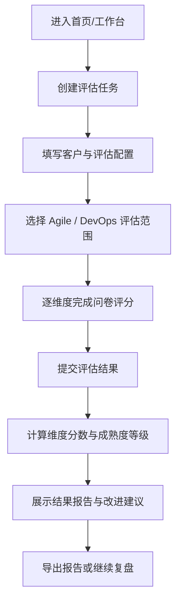

## 1. 产品概述
这是一个用于企业客户 Agile（Scrum）成熟度与 DevOps 成熟度评估的前端应用，帮助咨询顾问、交付经理和客户管理层快速完成问卷评估、生成结果洞察并输出改进建议。
- 产品聚焦“标准化评估 + 可视化结果 + 可操作改进建议”，降低人工访谈整理成本，提升成熟度诊断效率。
- 目标价值是形成统一评估口径，支持售前诊断、阶段复盘和持续改进跟踪。

## 2. 核心功能

### 2.1 用户角色
| 角色 | 进入方式 | 核心权限 |
|------|----------|----------|
| 咨询顾问/评估员 | 直接进入应用并创建评估 | 配置评估、填写问卷、查看报告、导出结果 |
| 客户代表 | 参与问卷填写或查看结果演示 | 填写评估项、查看成熟度得分与建议 |

### 2.2 功能模块
1. **首页/工作台**：产品介绍、评估入口、历史评估概览、评估维度说明。
2. **评估配置页**：客户名称、团队规模、行业、评估类型、评估范围、评估人信息。
3. **问卷评估页**：Agile（Scrum）题库、DevOps 题库、维度切换、分项评分、填写进度。
4. **结果报告页**：总分卡片、雷达图、维度详情、等级判定、关键短板、改进建议。

### 2.3 页面详情
| 页面名称 | 模块名称 | 功能描述 |
|-----------|-----------|-----------|
| 首页/工作台 | 顶部导航 | 展示产品名称、页面入口、开始评估按钮 |
| 首页/工作台 | 价值概览区 | 展示 Agile 与 DevOps 双成熟度评估的目标、方法和输出物 |
| 首页/工作台 | 评估维度卡片 | 展示 Scrum 与 DevOps 的一级维度及说明 |
| 首页/工作台 | 历史评估列表 | 展示最近评估记录、客户名称、时间、总分、状态 |
| 评估配置页 | 基本信息表单 | 填写客户名称、团队名称、团队规模、行业、评估日期 |
| 评估配置页 | 范围配置区 | 选择评估类型（仅 Agile、仅 DevOps、双评估）和评估对象 |
| 评估配置页 | 评估说明区 | 展示评分规则、成熟度等级说明、开始评估入口 |
| 问卷评估页 | 评估进度条 | 展示当前已完成题数、剩余题数、完成百分比 |
| 问卷评估页 | Agile 维度分组 | 包含 Scrum 角色与职责、事件执行、工件透明度、协作文化、度量改进等维度 |
| 问卷评估页 | DevOps 维度分组 | 包含代码管理、CI、测试自动化、环境一致性、发布治理、监控反馈、安全左移等维度 |
| 问卷评估页 | 题目评分卡片 | 题目描述、评分滑杆/单选、补充备注、证据提示 |
| 问卷评估页 | 暂存与提交区 | 保存当前结果、重置当前维度、提交评估 |
| 结果报告页 | 成熟度总览 | 展示 Agile 总分、DevOps 总分、综合等级、评估摘要 |
| 结果报告页 | 雷达图与条形图 | 展示双维度各子项得分分布，帮助识别强项与短板 |
| 结果报告页 | 维度分析区 | 展示每个维度的得分、等级、现状描述与主要问题 |
| 结果报告页 | 改进建议区 | 根据低分项输出分阶段建议，按短期、中期、长期组织 |
| 结果报告页 | 导出区 | 支持导出评估摘要、演示报告或打印视图 |

## 3. 核心流程
用户进入工作台后创建一次新的评估任务，填写客户与团队背景信息，选择评估范围后进入问卷页。问卷页按 Agile（Scrum）与 DevOps 两大域拆分为多个维度，用户逐项评分并可填写备注。提交后系统依据预置权重计算各维度分数与等级，在结果报告页展示总览、图表分析和改进建议，并支持导出结果。

## 4. 用户界面设计

### 4.1 设计风格
- 主色：深海军蓝、青绿色、暖金色点缀，传达专业咨询与治理能力。
- 按钮风格：圆角矩形按钮，主按钮强调色填充，辅按钮使用半透明描边。
- 字体与字号：中文使用思源黑体或更具展示感的现代无衬线组合；大标题强调稳重与科技感，正文保持高可读性。
- 布局风格：桌面优先，左侧导航 + 右侧内容工作区，结果页采用卡片式仪表盘布局。
- 图标风格：线性图标与少量几何装饰搭配，避免过度娱乐化。

### 4.2 页面设计概览
| 页面名称 | 模块名称 | UI 元素 |
|-----------|-----------|-----------|
| 首页/工作台 | 价值概览区 | 大标题、说明文字、双入口按钮、背景网格与数据光晕 |
| 首页/工作台 | 评估维度卡片 | 双列卡片、维度标签、等级说明、轻微悬浮动效 |
| 评估配置页 | 基本信息表单 | Ant Design 表单、分组标题、帮助提示、标签式选择器 |
| 问卷评估页 | 题目评分卡片 | 卡片列表、步骤导航、分段评分控件、备注输入框 |
| 问卷评估页 | 维度切换导航 | 左侧锚点导航、当前维度高亮、完成状态标记 |
| 结果报告页 | 成熟度总览 | KPI 数字卡片、等级徽标、摘要提示条 |
| 结果报告页 | 图表分析区 | 雷达图、横向条形图、颜色分级图例 |
| 结果报告页 | 改进建议区 | 分阶段时间轴、优先级标签、行动清单 |

### 4.3 响应式设计
- 采用桌面优先设计，适配常见笔记本与大屏演示场景。
- 平板与移动端保留查看能力，页面栈式布局，导航折叠为抽屉。
- 表单与图表在小屏下改为单列展示，并保证触控操作区域充足。
