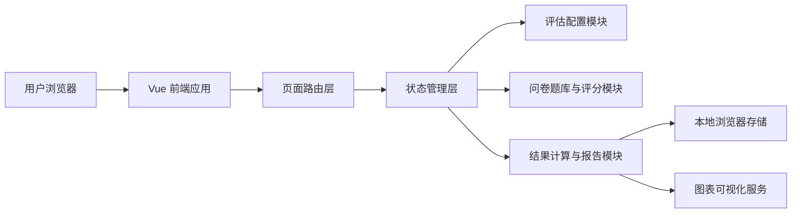
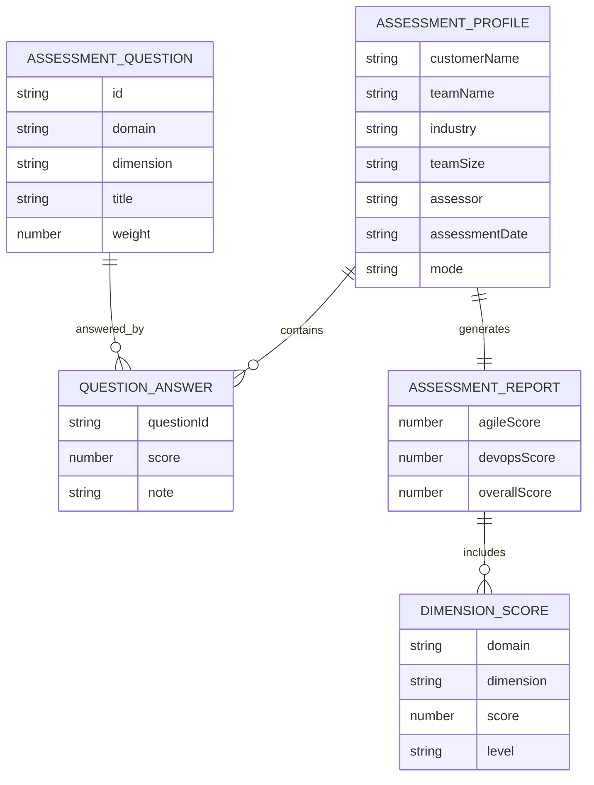

## 1. 架构设计



## 2. 技术说明
- 前端：Vue 3 + TypeScript + Vite
- UI 组件库：Ant Design Vue 4
- 状态管理：Pinia
- 路由：Vue Router 4
- 图表：ECharts + vue-echarts
- 样式方案：CSS 变量 + 组件级样式，配合全局主题文件
- 数据持久化：LocalStorage（首版无需后端）
- 初始化工具：Vite

## 3. 路由定义
| 路由 | 用途 |
|-------|------|
| / | 首页/工作台，展示产品入口、评估介绍和最近记录 |
| /assessment/new | 评估配置页，用于创建新的成熟度评估 |
| /assessment/run | 问卷评估页，用于完成 Agile / DevOps 评分 |
| /report | 结果报告页，用于展示评估结果与改进建议 |

## 4. API 定义
当前版本以前端本地数据驱动为主，不依赖远程后端接口。核心数据结构在前端以 TypeScript 类型维护，便于后续平滑接入服务端。

```ts
export type AssessmentMode = 'agile' | 'devops' | 'full';

export interface AssessmentProfile {
  customerName: string;
  teamName: string;
  industry: string;
  teamSize: string;
  assessor: string;
  assessmentDate: string;
  mode: AssessmentMode;
}

export interface QuestionOption {
  label: string;
  score: number;
  description: string;
}

export interface AssessmentQuestion {
  id: string;
  domain: 'agile' | 'devops';
  dimension: string;
  title: string;
  description: string;
  weight: number;
  options: QuestionOption[];
}

export interface QuestionAnswer {
  questionId: string;
  score: number;
  note?: string;
}

export interface DimensionScore {
  domain: 'agile' | 'devops';
  dimension: string;
  score: number;
  level: '初始' | '发展中' | '稳定' | '优化';
}

export interface AssessmentReport {
  profile: AssessmentProfile;
  agileScore: number;
  devopsScore: number;
  overallScore: number;
  dimensionScores: DimensionScore[];
  strengths: string[];
  risks: string[];
  recommendations: Array<{
    phase: '短期' | '中期' | '长期';
    title: string;
    detail: string;
  }>;
}
```

## 5. 服务端架构图
当前阶段无需服务端架构。若后续需要支持多客户、多评估任务协同与报告归档，可扩展为 `Controller -> Service -> Repository -> Database` 标准分层。

## 6. 数据模型

### 6.1 数据模型定义



### 6.2 数据定义语言
当前版本使用本地存储，无需数据库 DDL。浏览器中建议维护以下键：

```sql
-- 本地存储键建议
assessment_profile
assessment_answers
assessment_report
assessment_history
```

## 7. 前端模块划分
- `pages/home`：首页与历史评估概览。
- `pages/setup`：评估配置表单与说明信息。
- `pages/assessment`：问卷列表、维度导航、评分交互。
- `pages/report`：图表展示、等级判定、建议输出。
- `stores/assessment`：评估流程主状态，管理配置、答卷、结果与历史记录。
- `data/question-bank`：内置 Agile 与 DevOps 题库。
- `utils/scoring`：评分、等级映射、建议生成逻辑。

## 8. 非功能要求
- 保证首次加载后本地交互流畅，问卷切换与评分反馈应即时完成。
- 所有关键操作支持显式状态提示，避免用户误以为数据未保存。
- 图表和文本说明并存，结果不能只依赖图形表达。
- 后续应具备平滑扩展为后端版的能力，避免前端模型与页面强耦合。
